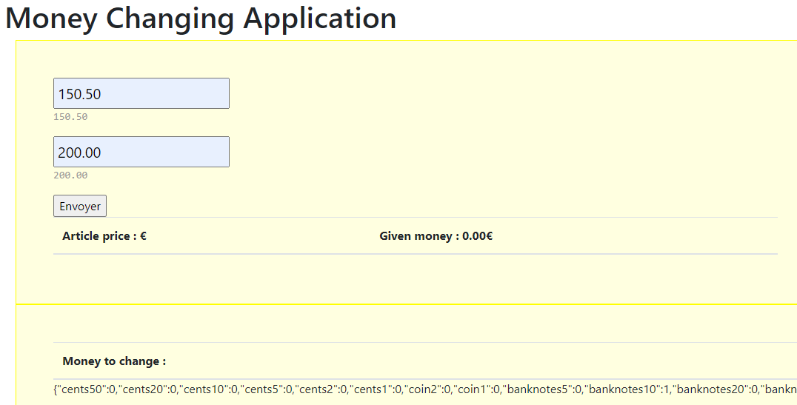

 *  * 

# Money_Changing

This app is about giving change.  

----

First, you must enter the article price. And after, set your given money for the change.  

The result tells us the number of banknotes, coins and cents that you must return to the client, trying to be as productive as possible by making only a minimum of money possible.  

BigDecimal is used, for money manipulation to avoid loss of precision.  

----

## **Example**  

!!!!! **IN DEVELOPMENT** !!!!!

